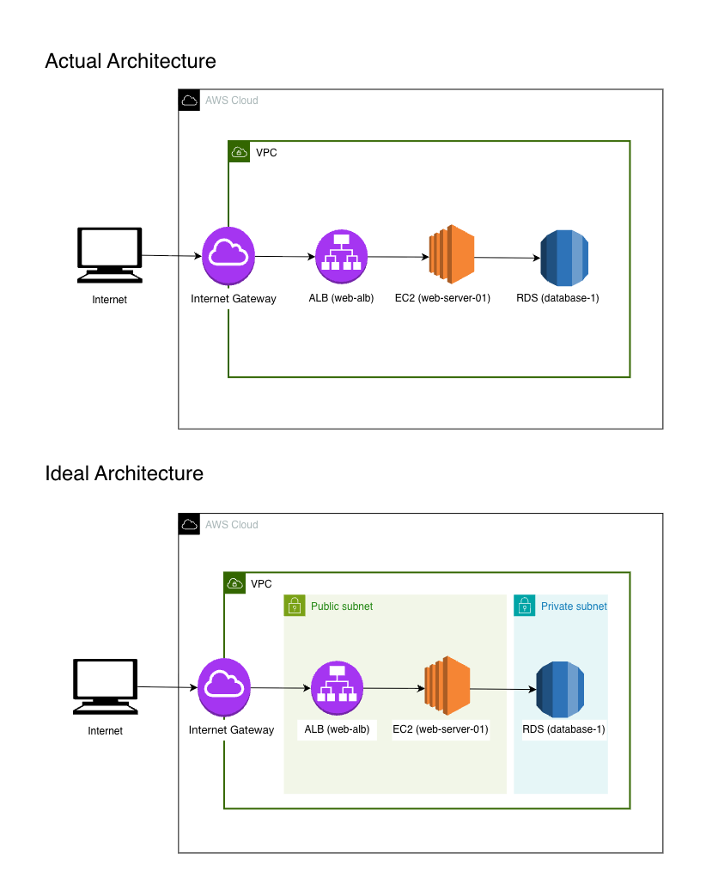
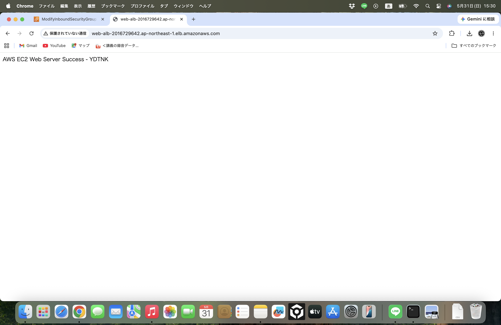
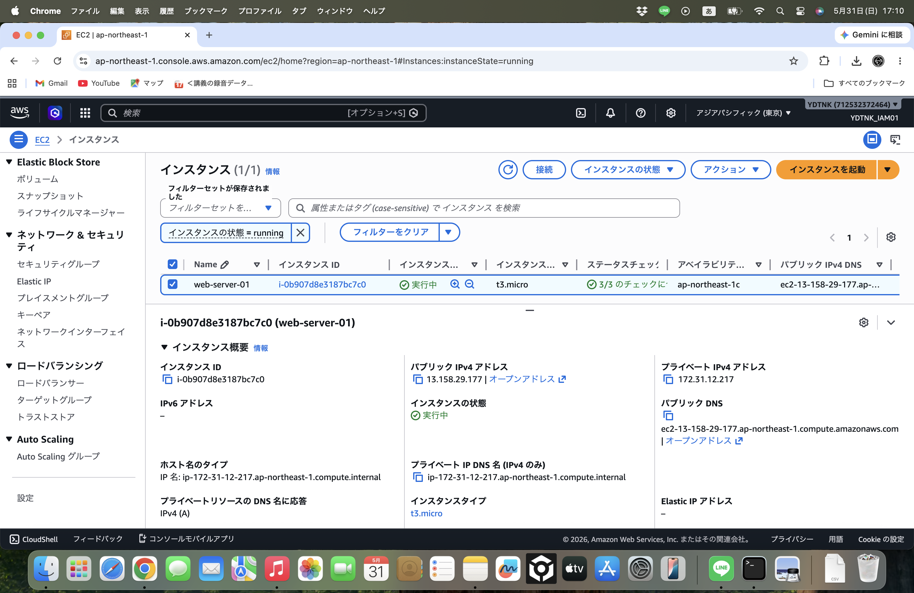
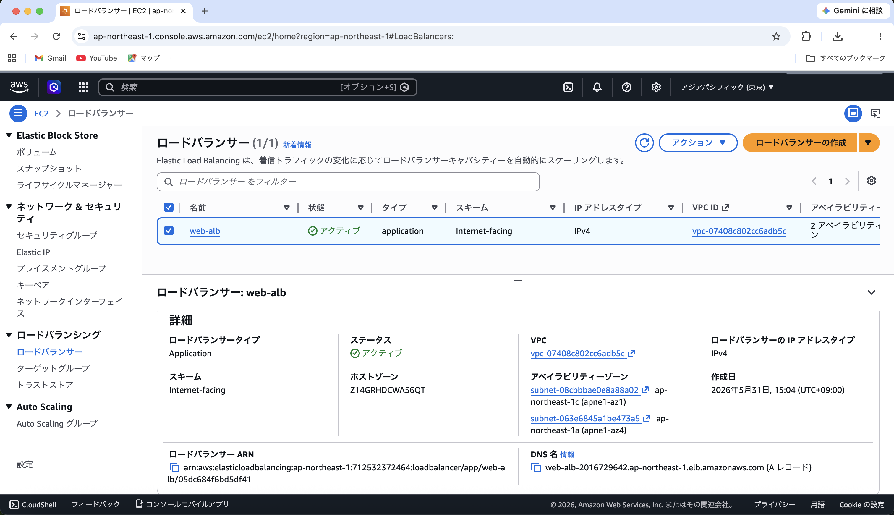
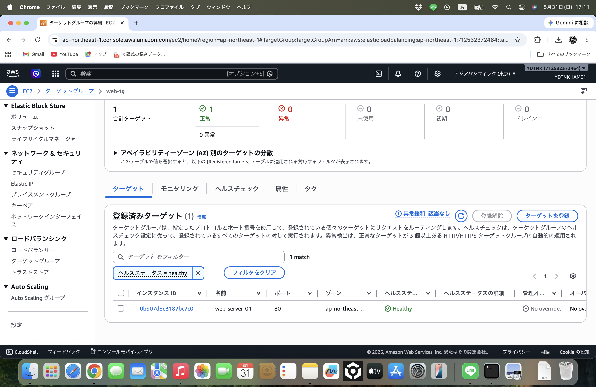
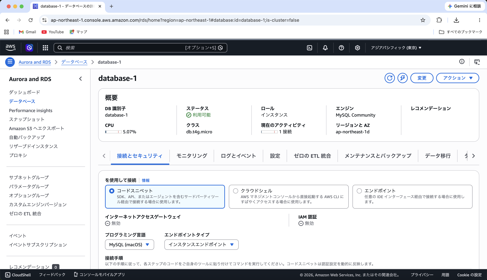
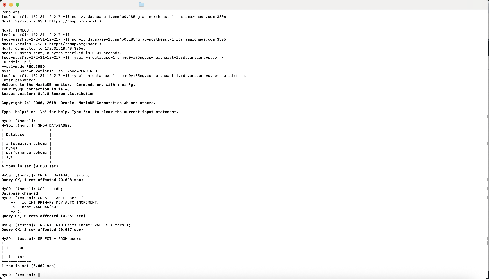
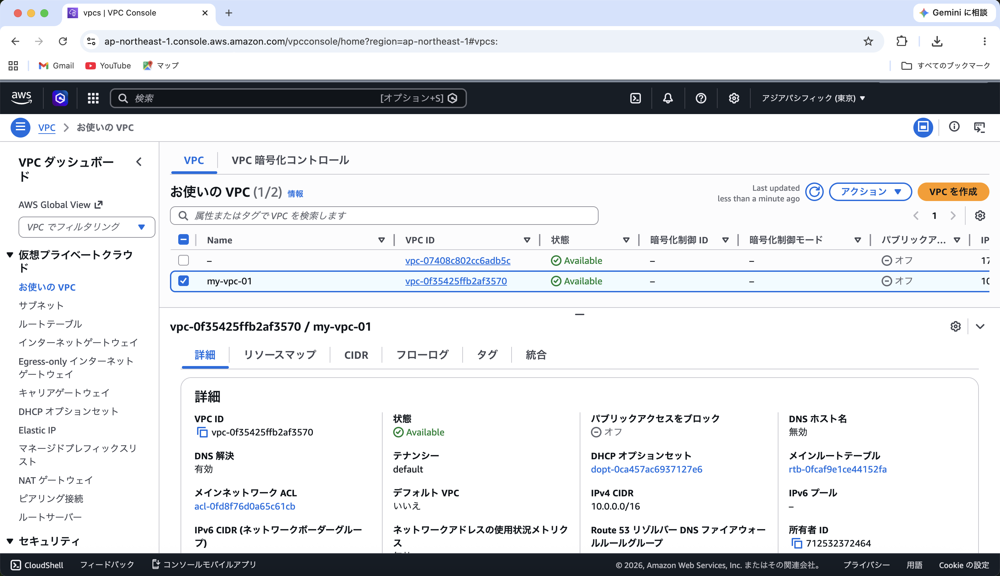
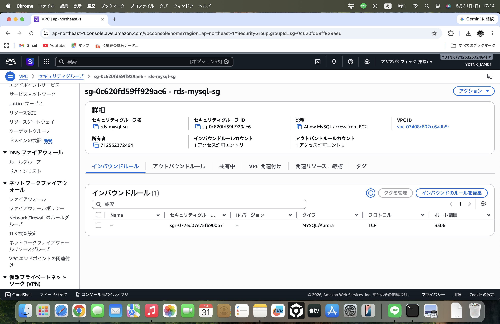

# AWS 3-Tier Web Architecture Hands-on

This project demonstrates a basic 3-tier web architecture built on AWS using VPC, ALB, EC2, and RDS.  
The goal is to understand how each layer interacts and to compare a simplified learning environment with a production-oriented design.

---

## Architecture Diagram

---

## Architecture Overview

### 1. Actual Architecture (Learning Environment)

This environment was built using a single VPC with basic subnet configuration for learning purposes.  
The main objective was to verify connectivity between AWS services and understand their integration.

- Resources are deployed in a simplified network structure
- Focus is on functional verification rather than strict production security design
- Subnet isolation is simplified for learning purposes

---

### 2. Ideal Architecture (Production-Grade Design)

This represents a production-ready 3-tier architecture with proper network segmentation.

- **Public Subnet**
  - Application Load Balancer (ALB)
  - EC2 (Web Server)

- **Private Subnet**
  - Amazon RDS (MySQL Database)

Key design principles:
- Database is not publicly accessible
- Traffic flows through ALB → EC2 → RDS
- Security Groups enforce strict communication control

---

## Objectives

- Understand AWS core services (VPC, EC2, ALB, RDS, CloudWatch)
- Learn public/private subnet design and network isolation concepts
- Implement load balancing using ALB
- Observe monitoring using CloudWatch metrics
- Compare learning vs production architecture

---

## Implementation Steps

- **Step 1: VPC Setup**
  - Create VPC, subnets, route tables, Internet Gateway

- **Step 2: EC2 Deployment**
  - Launch Amazon Linux instance
  - Install Apache/Nginx
  - Verify SSH and HTTP access

- **Step 3: S3 Setup**
  - Create bucket and upload static content

- **Step 4: CloudWatch Monitoring**
  - Configure CPU metrics and alarms

- **Step 5: ALB Configuration**
  - Create Application Load Balancer
  - Configure Target Group and routing

- **Step 6: RDS Deployment**
  - Launch MySQL database
  - Connect from EC2 and execute queries

---

## Verification Evidence

### 1. EC2 Web Server Success

### 2. EC2 Instances

### 3. Application Load Balancer

### 4. Target Group Health Check

### 5. RDS Instances

### 6. EC2 to RDS Connection

### 7. VPC Overview

### 8. Security Groups

---

## Key Learnings

- Proper subnet design is critical for secure cloud architecture
- ALB enables scalable traffic distribution
- RDS must be isolated in private subnets for security
- Security Groups are a key control layer in AWS networking

---

## Future Improvements

- Automate infrastructure using Terraform (IaC)
- Add Auto Scaling for EC2 instances
- Implement CloudWatch dashboards
- Build CI/CD pipeline for deployment
